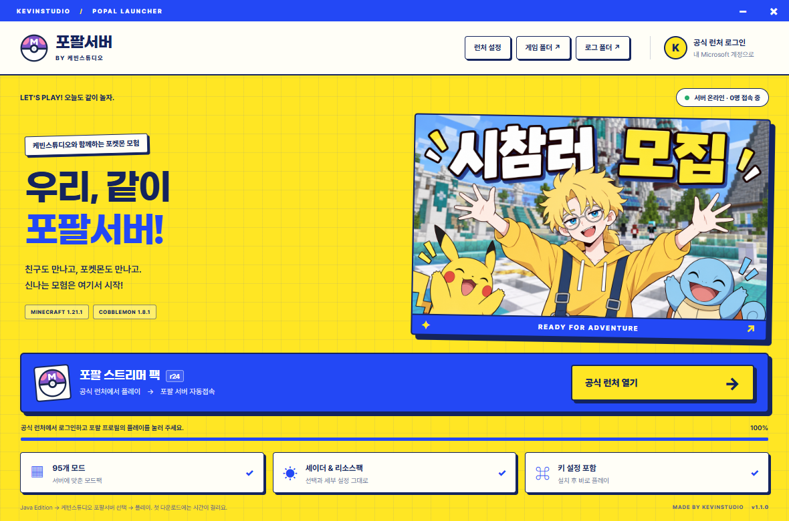

# 케빈스튜디오 · 포팔 서버

공식 Minecraft 런처와 연결해 포팔 서버 모드팩을 준비하는 Windows 64비트 설치기입니다.

**[Windows 설치 파일 다운로드](https://github.com/kevinnnchoi-blip/kevinstudio-popal-launcher/releases/download/v1.1.0/KevinStudio-Popal-Setup-1.1.0.exe)** · [릴리스 안내](https://github.com/kevinnnchoi-blip/kevinstudio-popal-launcher/releases/tag/v1.1.0)

1. 설치 파일을 실행합니다. 바탕화면에 **케빈스튜디오 포팔 서버** 바로가기가 생깁니다.
2. **공식 런처 열기**를 누릅니다. 공식 Minecraft 런처가 없으면 공식 다운로드 페이지가 열립니다. 설치 후 다시 눌러 주세요.
3. 공식 런처에서 Minecraft Java Edition을 보유한 Microsoft 계정으로 로그인합니다.
4. **Java Edition → 케빈스튜디오 포팔서버** 프로필을 선택하고 **플레이**를 누릅니다. 설치 목록에 보이지 않으면 ‘설치 설정’에서 모드 설치 표시를 켜 주세요.
5. 게임이 실행되면 **yangsook.com**에 자동 접속을 시도합니다. 첫 실행에는 공식 런처가 Java와 게임 파일을 다운로드합니다.

다음에 케빈스튜디오 설치기를 열면 5초 뒤 공식 런처를 엽니다. **공식 런처의 플레이는 직접 눌러야 합니다.** 설정에서 자동 열기와 게임 메모리를 바꿀 수 있습니다. 메모리 변경 후 공식 런처를 완전히 닫고 다시 열어 주세요.

## 포함 사항

- Minecraft 1.21.1 / Fabric 0.19.5 / Cobblemon 1.8.1
- r24 프로필의 모드 95개와 키 설정 84개
- ComplementaryReimagined r5.9.3 및 세부 설정
- 원본 리소스팩, 활성화 순서, 서버 목록

첫 설치의 214개 파일은 원본과 같습니다. 이후 사용자가 바꾼 키·화면·셰이더 세부 설정·서버 목록은 유지합니다. 모드·리소스팩·셰이더 ZIP은 배포본으로 확인하고 손상 시 기존 파일을 백업하여 복구합니다.

공식 런처에 전용 설치 프로필과 버전 정보를 추가합니다. 기존 설치 프로필과 설정은 보존하고 프로필 파일을 `.minecraft/kevinstudio-backups`에 백업합니다. 원본 Modrinth 프로필은 수정하지 않습니다. 게임 데이터는 `%APPDATA%\kevinstudio-popal`에 별도로 저장하며 제거 후에도 남깁니다.

## 1.1.0 검증 배포

웹사이트와 같은 노랑·파랑 디자인으로 바꾸고, 로그인은 공식 Minecraft 런처에서 처리하도록 변경했습니다. 이 버전은 DotsMine 인증 앱이나 해당 앱의 저장된 계정을 사용하지 않습니다. Microsoft 비밀번호나 공식 런처의 토큰을 읽지 않습니다.

실제 팩의 파일 일치·설정 보존·복구, 기존 공식 런처 프로필 보존, 서버 자동접속 인자, 화면 동작을 검증했습니다. **공식 런처에서 정품 로그인 후 게임 시작과 서버 입장 성공은 최종 확인이 남아 있습니다.** 자체 인증 앱 등록과 API 심사는 별도 진행 중이며 아직 승인받지 않았습니다.

현재 삽화는 케빈스튜디오 웹사이트에서 사용하는 이미지입니다. 새 삽화 생성은 완료되지 않았습니다. 코드서명 인증서는 사용하지 않아 Windows에서 게시자 미확인 경고가 표시될 수 있습니다. SHA256.txt로 설치 파일을 확인할 수 있습니다.

런처 제작: **케빈스튜디오**. 원본 게임·모드·리소스팩·셰이더의 권리는 각 제작자에게 있습니다. Minecraft 또는 Pokémon 공식 제품이 아닙니다.

이 저장소는 참가자용 설치 파일 배포 저장소입니다. v1.0.0 사용자는 1.1.0으로 업데이트해 주세요.
